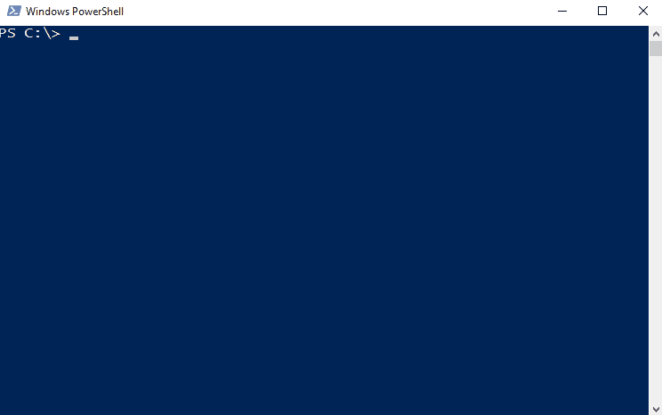

# Example: AppxPackages

This example uses Write-Menu to list the app packages (Windows Store/Modern Apps) that are installed for the current profile.



##Input

```powershell
# Include
. ..\Write-Menu.ps1

$menuReturn = Write-Menu -Title 'AppxPackages' -Entries (Get-AppxPackage).Name
Write-Host $menuReturn
```

##Console Output

```powershell
 AppxPackages

  Microsoft.NET.Native.Framework.1.1
  Microsoft.NET.Native.Framework.1.1
  Microsoft.NET.Native.Runtime.1.1
  Microsoft.Appconnector
  Microsoft.VCLibs.140.00
  Microsoft.WindowsCalculator
  Microsoft.NET.Native.Runtime.1.1
  Microsoft.WindowsStore
  windows.immersivecontrolpanel
  Microsoft.Windows.ShellExperienceHost
  Microsoft.Windows.Cortana
  Microsoft.AAD.BrokerPlugin
  Microsoft.AccountsControl
  Microsoft.BioEnrollment
  Microsoft.LockApp
  Microsoft.MicrosoftEdge

 Page 1 / 2
```

##Function Output

```powershell
AppxPackage.Name
```
