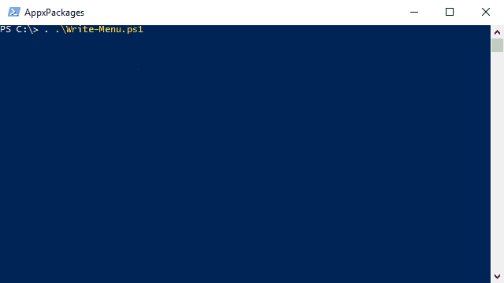

# Write-Menu

### -Title 'AppxPackages' -Sort -Entries (Get-AppxPackages).Name

### -Title 'AppxPackages' -Sort -MultiSelect -Entries (Get-AppxPackages).Name

_NOTE: The menu has been updated multiple times since capturing these screen-grabs, so they are no longer accurate..._

## Description

Outputs a command-line menu which can be navigated using the keyboard.

* Automatically creates multiple pages if the entries cannot fit on-screen.
* Supports nested menus using a combination of hashtables and arrays.
* No entry / page limitations (apart from device performance).
* Sort entries using the -Sort parameter.
* -MultiSelect: Use space to check a selected entry, all checked entries will be invoked / returned upon confirmation.
* Jump to the top / bottom of the page using the <kbd>Home</kbd> and <kbd>End</kbd> keys.

## Parameters

|  | Parameter | Example |
|:--|:--|:--|
| Required | Entries (array) | `-Entries @('Entry 1', 'Entry 2', 'Entry 3')` |
|          | Entries (hashtable) | `-Entries @{'Entry 1' = 'Write-Host "Command 1"'; 'Entry 2' = 'Write-Host "Command 2"'; 'Entry 3' = 'Write-Host "Command 3'"}` |
| Optional | Title | `-Title 'Example Title'` |
| Optional | Sort | `-Sort` |
| Optional | MultiSelect | `-MultiSelect`

## Examples

| Example | Description |
| :-- | :-- |
| [AdvancedMenu](Examples/AdvancedMenu.md) | Demonstrates all supported entry types (regular command + methods of adding a nested menu). |
| [AppxPackages](Examples/AppxPackages.md) | Uses Write-Menu to list app packages (Windows Store/Modern Apps) |
| [CustomMenu](Examples/CustomMenu.md) | Generates a custom menu by manually specifying each entry |

## Controls

| Key | Description |
|:--|:--|
| <kbd>Up</kbd> | Previous entry |
| <kbd>Down</kbd> | Next entry |
| <kbd>Left</kbd> / <kbd>PageUp</kbd> | Previous page|
| <kbd>Right</kbd> / <kbd>PageDown</kbd> | Next page |
| <kbd>Home</kbd> | Jump to top |
| <kbd>End</kbd> | Jump to bottom |
| <kbd>Space</kbd> | `-MultiSelect` Select current |
| <kbd>Insert</kbd> | `-MultiSelect` Select all |
| <kbd>Delete</kbd> | `-MultiSelect` Select none |
| <kbd>Enter</kbd> | Confirm selection |
| <kbd>Esc</kbd> / <kbd>Backspace</kbd> | Exit / Previous menu |

